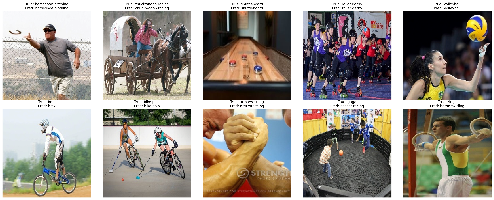
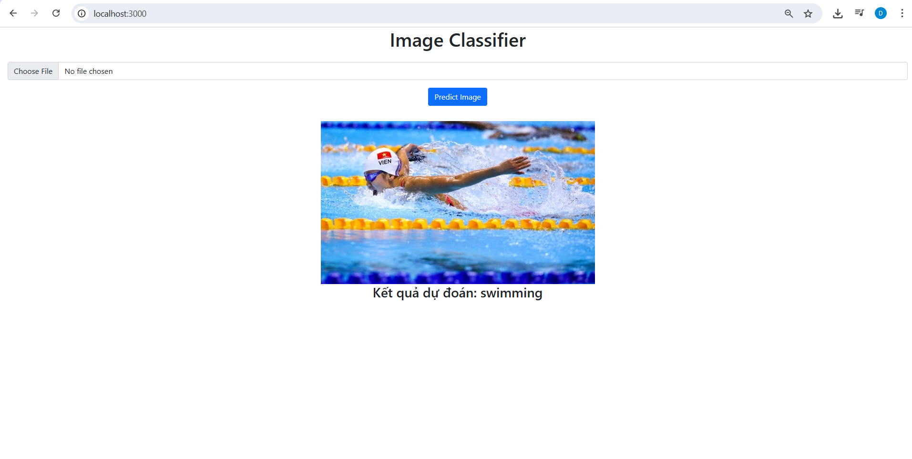

# [PROJECT] 100 Sports Classification

## Introduction

This project aim to help us when an image is upload, what sport are the image in the picture?

## Setup
Using Flask to run local host file
> pip install flask

## Datasets
https://www.kaggle.com/datasets/gpiosenka/sports-classification/code

## Notices
The model i was trained in folders Models, i train it from scratch, with higher 80% accuracy with val_test. I also use some higher techniques such as Data Augumentation to avoid overfit,
Batch Normalization, Kaiming He initialization to avoid gradient vanishing, skip connection and dropout to improve my models.
## Examples
 
This is some predict in my test accuracy.
  
This is an image when i try to run in my local.
## Requirements
* **Python**
* **CNN Architecture**
* **Flask try to deploy our model**
